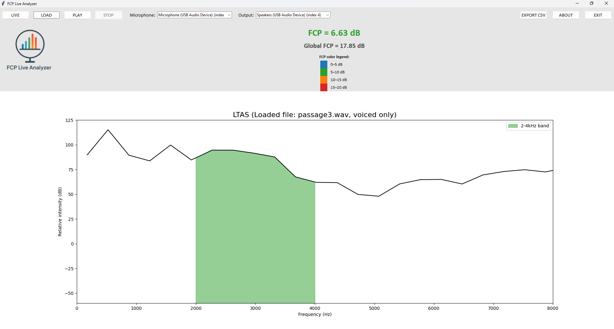

# FCP Live Analyzer



**FCP Live Analyzer** is a user-friendly software tool specifically designed for singers, voice researchers, and voice teachers to measure and train vocal techniques related to the **Formant Cluster Prominence (FCP)**. This acoustic measure is crucial for evaluating the "singer's formant," an acoustic feature prominent in classically trained singing voices.

---

## What is Formant Cluster Prominence (FCP)?

Formant Cluster Prominence (FCP) is an acoustic metric proposed by **Lã et al. (2021)**. It quantifies the prominence of the higher formant cluster, typically in the frequency range of **2–4 kHz**, which is essential for the singer’s formant phenomenon. A strong singer’s formant significantly improves vocal projection and audibility over orchestral accompaniment.

The FCP specifically represents the difference between the peak of the long-term average spectrum (LTAS) in the **2–4 kHz range** and a trend line calculated from **1–5 kHz**.

---

## Key Features

### 1. Load Audio File and Playback Analysis
- Easily load `.wav` audio files.
- Segments voiced regions from audio and calculates LTAS.
- Displays dynamic FCP values during audio playback with visual feedback.
- Calculates and displays the Global FCP.

### 2. Live Analysis and Real-time Feedback
- Real-time analysis via microphone.
- Continuously updates current FCP during singing.
- Displays dynamic mean FCP value.

### 3. Detailed Acoustic Analysis
- LTAS calculation following methodologies by Lã et al. (2021).
- Graphical visualization of LTAS and FCP.
- Precise numerical outputs for detailed comparative analyses.

### 4. Export and Reporting
- Exportable results as `.csv` files.

### 5. Professional and Research Use
- Ideal for singers, vocal coaches, researchers, and educators.
- Enhances vocal projection and formant tuning.
- Facilitates scientific studies on vocal techniques.

---

## Calculation Methodology

- Compute the LTAS of voiced segments.
- Identify the maximum LTAS value in 2–4 kHz band.
- Fit a trend line across the 1–5 kHz range.
- FCP is the difference between the peak in the 2–4 kHz range and the trend line value.

---

## Requirements and Installation

### Software Requirements:
- Python (≥ 3.10)
- Praat software

### Python Dependencies:
```bash
pip install numpy scipy matplotlib sounddevice soundfile parselmouth
```

### Building the Software
```bash
pyinstaller --onedir --windowed --noconfirm --clean --icon=logo_fcp.ico fcp_live_gui.py
```

---

## Usage

### GUI Interface
- **LOAD**: Load `.wav` file.
- **LIVE**: Real-time microphone input.
- **PLAY**: Playback loaded audio.
- **EXPORT CSV**: Export data for review.

---

## Contributions
Feel free to contribute, open issues, or suggest new features.

---

## References
- Lã, F. M. B., Silva, L. S., & Granqvist, S. (2023). Long-term average spectrum characteristics of Portuguese Fado-Canção from Coimbra. Journal of Voice, 37(4), 631.e1-631.e7. https://doi.org/10.1016/j.jvoice.2021.03.021.
- Sundberg, J. (1995). The Singer's Formant Revisited. Quarterly Progress and Status Report, 36(2-3), 83–96. Royal Institute of Technology (KTH), Stockholm.

---

## Contact
- **Developer**: Tiago Lima Bicalho Cruz, PhD
- **Email**: tiagolbc@gmail.com

## Citation
- Cruz, T. L. B. (2025). FCP Live Analyzer: Real-Time Acoustic Analysis of Singer’s Formant and Formant Cluster Prominence (Version 1.0.0) [Computer software]. Zenodo. https://doi.org/10.5281/zenodo.15579953

---

Enjoy using the **FCP Live Analyzer**!
